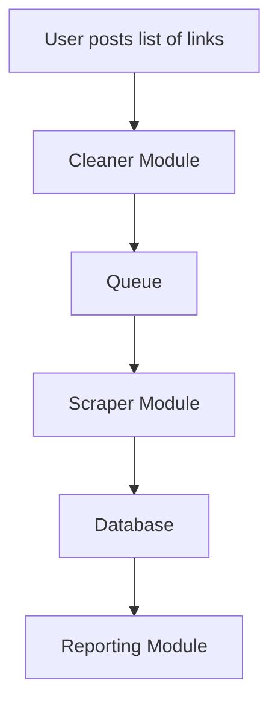

# Job Search Data Pipeline

## Overview
This project is designed to help you collect, clean, analyze, and report on job listings over time. The goal is to compile detailed statistics such as average salary for given years of experience, technology stack, and more, to support your job search and market research.

### Project Vision
1. **Link Collection**: Post lists of job offer links to the system.
2. **Cleaner Module**: Removes duplicates and unnecessary URL parameters.
3. **Queue System**: Cleaned links are published to a queue for asynchronous processing.
4. **Scraper Module**: Consumes links from the queue, scrapes job pages, and extracts fields like years of experience, salary, tech stack, benefits, and location.
5. **Database Storage**: Extracted data is saved to a database for further analysis.
6. **Reporting Module**: Generates reports such as average salary per technology stack, word clouds for job types, and various graphs.

### Architecture Diagram


## Database Schema
The following fields are stored in the database for each job listing:

| Field | Type | Description |
| :--- | :--- | :--- |
| `category` | VARCHAR | 'Data', 'Mobile', 'QA', 'Security', 'UX/UI', 'Ruby', 'Manager', 'DevOps', 'Backend', 'Frontend', 'Fullstack', 'AI', 'Support' |
| `tech_stack` | TEXT | |
| `comment` | TEXT | |
| `status` | VARCHAR | 'sent', 'got response', 'not interested', 'meeting set', 'offer', 'rejected', 'other'|
| `sent_date` | DATE | |
| `response_date` | DATE | |
| `link` | TEXT | |
| `title` | VARCHAR | |
| `location` | VARCHAR | |
| `location_type` | VARCHAR | 'remote', 'office', 'hybrid' |
| `salary` | TEXT | |
|`salary_min_normalized`| Number| |
|`salary_max_normalized`| Number| |
| `salary_type` | VARCHAR | 'UOP', 'B2B H', 'B2B M', 'Substitution', 'Dzieło', 'Zlecenie' |
| `years_of_experience` | TEXT | |
|`years_of_experience_normalized`| Number| |
| `company` | VARCHAR | |
| `company_link` | VARCHAR | |
| `company_description` | TEXT | |
| `responsibilities` | TEXT | |
| `requirements` | TEXT | |
| `benefits` | TEXT | |
| `body` | TEXT | raw html |
| `full_offer` | TEXT | |
| `date_of_access` | DATE | |

## Scripts Usage

### 1. Data Collection
   Once everything works paste links to `links/new.txt` and run
   ```bash
   python process_new.py
   ```
   That will perform following steps:
   - initialize database
   - clean links
   - add to queue
   - scrape jobs
   - save to database

#### 1.1 Initialize Database
Sets up the PostgreSQL database and `job_offers` table.
```bash
python init_db.py
```

#### 1.2 Clean Links
Removes duplicates and cleans URL parameters from a list of links.
```bash
python links-cleener.py input_file.txt [output_file.txt]
```

#### 1.3 Scrape a Single Job
Scrapes a job page and prints the data to the console (JSON format).
```bash
python scrape_job.py <url>
```

#### 1.4 Save Job to Database
Scrapes a job page and saves it to the `job_offers` table.
```bash
python save_to_db.py <url>
```

### 2. Reporting
Prints the titles of all jobs currently in the database.
```bash
python reporting.py
```

## How to Use (Workflow)

1. **Prepare your input file**
   - Place your file with job links (one per line) in the project directory.

2. **Run the cleaner script**
   - Open a terminal in the project directory.
   - To clean a file in-place:
     ```
     python links-cleener.py nofluff.txt
     ```
   - To clean and write to a new file:
     ```
     python links-cleener.py nofluff.txt cleaned_nofluff.txt
     ```

3. **Result**
   - The output file will contain unique links with postfixes removed.


**Planned modules:**
- if link is to the same page with just different parameter, append it
- add subcategories
- add normalization for salary
- add normalization for years of experience
- learning how to use rabbitmq
- Asynchronous queue and scraper
- Reporting and analytics (graphs, word clouds, salary stats)