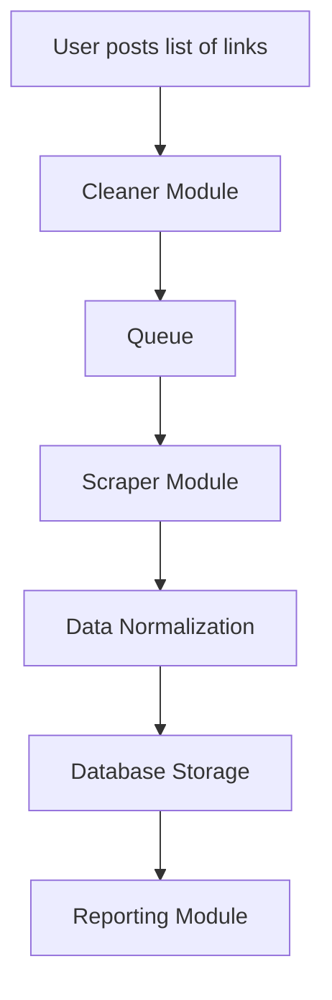

# Job Search Data Pipeline

## Overview
This project is designed to help you collect, clean, analyze, and report on job listings over time. The goal is to compile detailed statistics such as average salary for given years of experience, technology stack, and more, to support your job search and market research.

### Project Vision
1. **Link Collection**: Post lists of job offer links to the system.
2. **Cleaner Module**: Removes duplicates and unnecessary URL parameters.
3. **Queue System**: Cleaned links are published to a queue for asynchronous processing. *TBD if needed*
4. **Scraper Module**: Consumes links from the queue, scrapes job pages, and extracts fields like years of experience, salary, tech stack, benefits, and location.
5. **Data Normalization**: Normalizes extracted data, like years of experience, salary, tech stack, benefits, and location.
6. **Database Storage**: Extracted data is saved to a database for further analysis.
7. **Reporting Module**: Generates reports such as average salary per technology stack, word clouds for job types, and various graphs.

### Architecture Diagram

```mermaid
flowchart TD
    A[User posts list of links] --> B[Cleaner Module]
    B --> C[Queue]
    C --> D[Scraper Module]
    D --> E[Data Normalization]
    E --> F[Database Storage]
    F --> G[Reporting Module]
```

## Database Schema

### Job Offers Table
The following fields are stored in the database for each job listing:

| Field | Type | Description |
| :--- | :--- | :--- |
| `category` | VARCHAR | 'Data', 'Mobile', 'QA', 'Security', 'UX/UI', 'Ruby', 'Manager', 'DevOps', 'Backend', 'Frontend', 'Fullstack', 'AI', 'Support' |
| `tech_stack` | TEXT | |
| `frontend_stack` | TEXT | *TBD* |
| `backend_stack` | TEXT | *TBD* |
| `db_stack` | TEXT | *TBD* |
| `comment` | TEXT | |
| `status` | VARCHAR | 'sent', 'got response', 'not interested', 'meeting set', 'offer', 'rejected', 'other'|
| `sent_date` | DATE | |
| `response_date` | DATE | |
| `link` | TEXT | |
| `title` | VARCHAR | |
| `location` | VARCHAR | |
| `location_type` | VARCHAR | 'remote', 'office', 'hybrid' |
| `salary` | TEXT | |
|`salary_min_normalized`| Number| recalculted to PLN, monthly, nett value |
|`salary_max_normalized`| Number| recalculted to PLN, monthly, nett value |
| `salary_type` | VARCHAR | 'UOP', 'B2B H', 'B2B M', 'Substitution', 'Dzieło', 'UZ' |
| `years_of_experience` | TEXT | |
|`years_of_experience_normalized`| Number| |
| `company` | VARCHAR | |
| `company_link` | VARCHAR | |
| `company_description` | TEXT | |
| `responsibilities` | TEXT | |
| `requirements` | TEXT | |
| `benefits` | TEXT | |
| `body` | TEXT | raw html |
| `full_offer` | TEXT | |
| `date_of_access` | DATE | |

### Companies Table TODO TBD

| Field | Type | Description |
| :--- | :--- | :--- |
| `name` | VARCHAR | |
| `link` | VARCHAR | |
| `description` | TEXT | |
| `category` | VARCHAR | |
| `number_of_employees`| Number | |
| `found_date`| Date | |
| `headquarters`| VARCHAR | |
| `postings_per_categories`| VARCHAR | |

### Technologies Table TODO TBD

| Field | Type | Description |
| :--- | :--- | :--- |
| `name` | VARCHAR | |
| `category` | VARCHAR | |
| `number_of_postings` | Number | |
| `average_salary` | Number | |
| `average_years_of_experience` | Number | |


## Scripts Usage

### 1. Data Collection
To process new job links, add them to `links/new.txt` (one URL per line) and run:
```bash
python run_pipeline.py
```

This launcher script executes the following four stages:
1. **[Step 1/4] Database Schema & Connection Verification**: Creates the PostgreSQL database and `job_offers` table if they do not exist, and runs an active connection test.
2. **[Step 2/4] LLM Support Verification (Ollama)**: Verifies that the Ollama server is up and running locally, and confirms that the model configured in `.env` (`OLLAMA_MODEL`) is pulled and ready.
3. **[Step 3/4] Publishing Links**: Reads and cleans URLs from `links/new.txt`, queries PostgreSQL to skip any already-processed URLs, and publishes new URLs to the RabbitMQ queue (`job_links`). It then clears `links/new.txt`.
4. **[Step 4/4] Starting Consumer Worker(s)**: 
   - By default (or with `--workers 1`), it starts a single consumer worker in the foreground.
   - If `--workers N` is specified (where $N > 1$), it spawns $N$ consumer workers in the background as separate processes to process job links in parallel.

To run with multiple workers, use:
```bash
python run_pipeline.py --workers 2
```

#### 1.1 Initialize Database
Sets up the PostgreSQL database and `job_offers` table:
```bash
python src/db/init_db.py
```

#### 1.2 Clean Links
Removes duplicates and query parameters from a list of links:
```bash
python src/utils/links_cleaner.py input_file.txt [output_file.txt]
```

#### 1.3 Scrape a Single Job
Scrapes a single job page and prints the extracted data to the console in JSON format:
```bash
python src/scraping/scrape_job.py <url>
```

### 2. Reporting
Prints the titles of all jobs currently in the database:
```bash
python reporting.py
```

## How to Use (Workflow)

1. **Prepare your input file**
   - Place your file with job links (one per line) in the project directory.

2. **Run the cleaner script**
   - Open a terminal in the project directory.
   - To clean a file in-place:
     ```bash
     python src/utils/links_cleaner.py nofluff.txt
     ```
   - To clean and write to a new file:
     ```bash
     python src/utils/links_cleaner.py nofluff.txt cleaned_nofluff.txt
     ```

3. **Result**
   - The output file will contain unique links with query postfixes and parameters removed.


**TODO**
- add support to use db schema in queries like types
- Catogerize technology tags - for agent get all tags and try to categorize them for frondend, backend, db, devops, ai, qa, security, mobile, other
- Schetch up UI for reporting
- Add subcategories, like fronted in  react
- Reporting and analytics (graphs, word clouds, salary stats, tech tags per category)