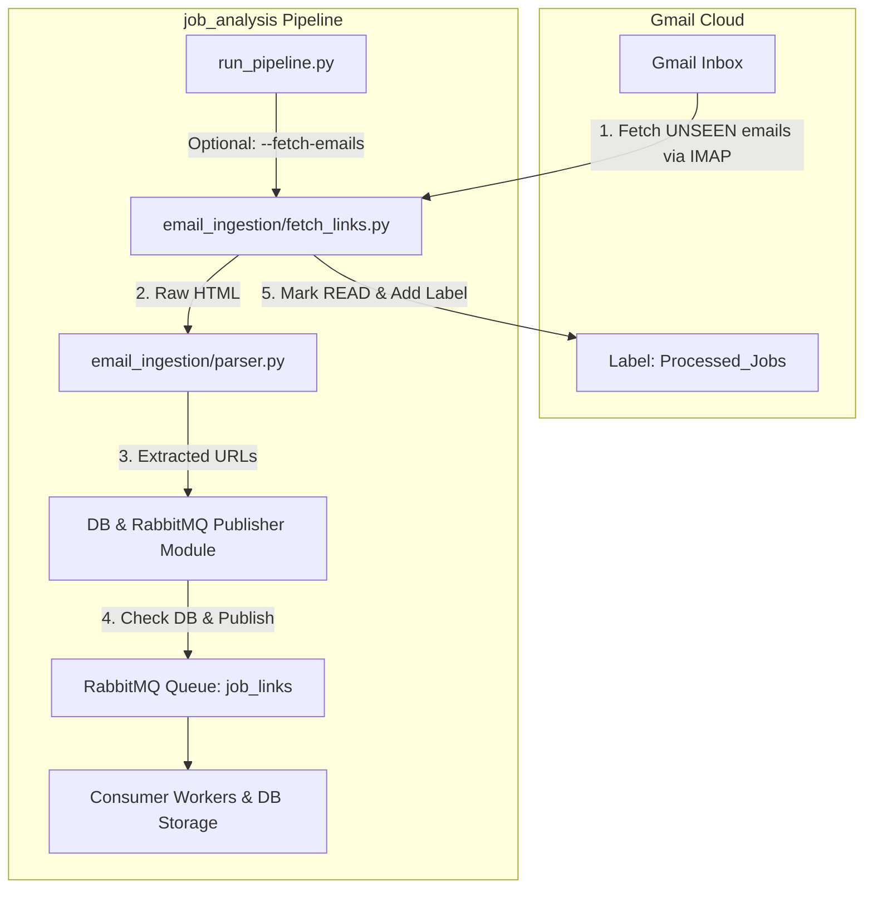

# Product Design Requirements (PDR): Automated Email Job Link Extractor

**Project**: `job_analysis`  
**Status**: Revised / Approved  
**Version**: 1.1  
**Author**: Antigravity & User  

---

## 1. Overview & Business Objective

Currently, job search alerts from portals like **JustJoin.it**, **Pracuj.pl**, **NoFluffJobs**, and **theprotocol.it** arrive in a Gmail inbox.

This feature automates the email link collection phase directly into the `job_analysis` processing pipeline:
1. Connects to Gmail in the background via IMAP (`imaplib`).
2. Identifies unread job alert emails.
3. Extracts relevant job offer links matching target portal domain patterns, filtering out non-job links (unsubscribe, privacy policies, footers).
4. **Direct Publisher Integration**: Validates and publishes clean job URLs directly into the Publisher / RabbitMQ queue (skipping intermediate file writes to `links/new.txt`).
5. Marks processed emails as **READ** and labels/moves them to a `Processed_Jobs` folder in Gmail.

---

## 2. Technical Decisions & Alignment

| Dimension | Decision | Rationale |
| :--- | :--- | :--- |
| **Protocol** | **IMAP (SSL)** via `imaplib` | Lightweight, standard Python library, no complex OAuth webflow needed. Uses 16-char Gmail App Password. |
| **Parsing** | `email` + `BeautifulSoup4` | Reliable HTML email tree traversal and `<a>` tag extraction. |
| **Target Portals** | **JustJoin.it, Pracuj.pl, NoFluffJobs, theprotocol.it** | Focused on specified Polish and tech job alert emails. |
| **Link Ingestion Flow** | **Direct to Publisher (No intermediate file)** | Extracted links undergo database deduplication check and are directly published to RabbitMQ queue `job_links`. |
| **Code Structure** | Dedicated Package (`src/email_ingestion/` or `email_ingestion/`) | Decoupled email fetching module. |
| **Pipeline Integration** | Standalone CLI + `run_pipeline.py` integration | Can be run independently (`python -m email_ingestion.fetch_links`) or via `python run_pipeline.py --fetch-emails`. |
| **Post-Processing** | Mark as READ & Apply Label `Processed_Jobs` | Prevents re-processing emails and keeps the main Inbox tidy. |

---

## 3. Data & Control Flow Architecture



---

## 4. Security & Credential Protection (GitHub & LLM)

To guarantee that your email credentials and passwords are **never leaked to GitHub** or **sent to LLMs**:

1. **Git Protection (`.gitignore`)**:
   - `.env` is explicitly listed in [.gitignore](file:///c:/Users/wojna/Code,%20Data,%20Study/code/job_analysis/.gitignore).
   - Git will completely ignore `.env`. It can never be staged, committed, or pushed to remote repositories.
   - We maintain a safe `.env.example` file in git with dummy placeholder values (`GMAIL_USER=your_email@gmail.com`).

2. **LLM & Prompt Protection**:
   - Real passwords stored in `.env` are loaded strictly at runtime by your local Python process (`python-dotenv` / `os.getenv`).
   - The assistant and automated tools do not log, print, or transmit contents of `.env` passwords into LLM prompts.

---

## 5. Component Specifications

### 5.1 Configuration (`.env` & `email_ingestion/config.py`)
Add to local `.env`:
```env
# Email Ingestion Settings
GMAIL_USER=your_email@gmail.com
GMAIL_APP_PASSWORD=your_16_char_app_password
GMAIL_IMAP_SERVER=imap.gmail.com
GMAIL_IMAP_PORT=993
GMAIL_LABEL_PROCESSED=Processed_Jobs
```

### 5.2 Target Domain Filters (`email_ingestion/parser.py`)
* **Allowed Job Domain Rules**:
  - `justjoin.it/offers/`
  - `pracuj.pl/praca/`
  - `nofluffjobs.com/job/`
  - `theprotocol.it/szczegoly/` / `theprotocol.it/oferta/`
* **Exclusion Patterns**:
  - `unsubscribe`, `privacy`, `settings`, `preferences`, `facebook`, `twitter`, `instagram`, `logo`

### 5.3 Direct Pipeline Ingestion Logic (`email_ingestion/fetch_links.py`)
1. Connect via SSL (`imaplib.IMAP4_SSL`).
2. Verify/Create label `Processed_Jobs`.
3. Search unread emails (`(UNSEEN)`).
4. Parse email HTML & extract matching portal links.
5. Pass URLs directly to pipeline publisher (`publish_links(...)`), which checks PostgreSQL to skip existing links and pushes new ones to RabbitMQ `job_links`.
6. Mark email as `\Seen` and copy/move to `Processed_Jobs`.

---

## 6. File System Layout

```
job_analysis/
├── email_ingestion/
│   ├── __init__.py
│   ├── config.py           # Config loader & portal domain regex patterns
│   ├── fetch_links.py      # IMAP email listener & pipeline integration
│   └── parser.py           # HTML email link parsing & exclusion logic
├── run_pipeline.py         # Updated to support --fetch-emails flag
├── email_ingestion_pdr.md  # Product Design Requirements
├── .env.example            # Safe repository template (no real secrets)
└── .env                    # Local file ignored by git (.gitignore)
```

---

## 7. Implementation Roadmap

- [ ] **Task 1**: Create `email_ingestion/` directory structure and `config.py`.
- [ ] **Task 2**: Implement `parser.py` (HTML parsing & URL filtering for JustJoin.it, Pracuj.pl, NoFluffJobs, theprotocol.it).
- [ ] **Task 3**: Implement `fetch_links.py` (IMAP connection, Gmail labeling, direct call to DB check & RabbitMQ publisher).
- [ ] **Task 4**: Add `--fetch-emails` CLI flag to [`run_pipeline.py`](file:///c:/Users/wojna/Code,%20Data,%20Study/code/job_analysis/run_pipeline.py).
- [ ] **Task 5**: Verify `.env` security and test execution.
