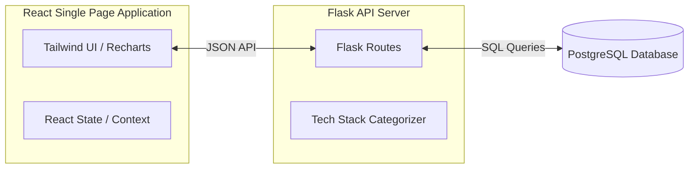

# UX/UI Reporting Module Design Document

This document outlines the design, architecture, layout, and API specification for the Job Search Reporting and Analytics dashboard.

---

## 1. System Architecture

The reporting module is structured as a lightweight local dashboard with decoupled frontend and backend components.



- **Frontend**: React (Single Page Application) initialized via Vite, styled using Tailwind CSS, and using Recharts for data visualization.
- **Backend**: Python Flask API running locally. It handles query filtering, database calls to PostgreSQL, and tech tag aggregation.
- **Deployment**: Both servers run locally during development (React dev server on port `5173`, Flask on port `5000`).

---

## 2. UI/UX Design System

To match the developer-focused nature of the pipeline, the design adopts a premium, dark-mode developer aesthetic with vibrant green highlights.

### Color Palette
- **Backgrounds**: Slate-900 / Zinc-950 (ultra-dark base)
- **Cards/Containers**: Slate-800 / Zinc-900 with subtle borders
- **Primary Highlights**: Foliage Green (`#44a463`) and its scale variants (glowing accents, active tabs, buttons)
- **Success/Neutral/Error**: standard tailwind colors for statuses (`got response` = Green, `rejected` = Rose, `sent` = Sky)

### Layout Wireframe
```
+------------------------------------------------------------------------------------+
|  [Sidebar Navigation]     |  [Main Header] Job Search Dashboard                    |
|                           |  Filters: [Category: All] [Contract: All]              |
|  (icon) Dashboard         +--------------------------------------------------------+
|  (icon) Salary Analytics  |  [KPI Cards]                                           |
|  (icon) Tech Insights     |  +----------------+  +----------------+  +----------+  |
|  (icon) Job Board         |  | Total: 154     |  | Avg: 18,500 PLN|  | Sent: 45 |  |
|                           |  +----------------+  +----------------+  +----------+  |
|  [Logo / Brand]           |                                                        |
|  JobTracker v1            |  [Dashboard Content / Charts]                          |
+---------------------------+--------------------------------------------------------+
```

---

## 3. Dashboard Tabs & Features

### Tab 1: Dashboard (Overview)
- **KPI Summary Cards**:
  - Total Offers Scraped
  - Average Salary (PLN/month, normalized net)
  - Conversion Rate (applications sent vs. interview requests)
  - Top Company hiring
- **Application Funnel Chart**: A horizontal bar chart or funnel chart visualizing job counts across status categories (`sent`, `got response`, `meeting set`, `offer`, `rejected`).
- **Recent Offers List**: A small card listing the 5 most recently scraped job offers.

### Tab 2: Salary Analytics
- **Salary vs. Experience Scatter Plot**: An interactive scatter plot mapping salary normalized values against years of experience.
  - Hovering over a dot reveals the job title, company, salary, and experience details.
- **Filters**:
  - **Contract Type Toggle**: Filter by UOP vs. B2B contract types.
  - **Category Filter**: Select specific job fields (Data, Backend, Frontend, Fullstack, DevOps).

### Tab 3: Technology Insights
- **Tech Stack Category Breakdown**: A donut chart showing the distribution of technologies across major domains:
  - `Frontend`, `Backend`, `Database`, `DevOps`, `AI/LLM`, `QA`, `Security`, `Mobile`, `Other`.
- **Top Tech Stack Bar Chart**: A horizontal bar chart showing the most frequently requested tools (e.g., Python, Docker, React, AWS).
- **Interactive Tag Selector**: Clicking a tech tag dynamically shows a mini-list of jobs requesting that technology.

### Tab 4: Job Board
- **Filterable Data Table**:
  - Search by company, title, or tags.
  - Sort columns by sent date, company name, or salary.
- **Inline Status Editor**: Dropdowns directly inside the table rows allowing the user to update the offer status (`sent`, `got response`, etc.) or add quick text comments. These changes persist to the database instantly.

---

## 4. Technology Tag Categorization

The Flask backend contains a predefined mapping dictionary to normalize raw tags into standard categories:

```python
TECH_CATEGORY_MAPPING = {
    # Frontend
    "react": "Frontend", "angular": "Frontend", "vue.js": "Frontend", "vue": "Frontend", "typescript": "Frontend", "javascript": "Frontend", "css": "Frontend", "html": "Frontend", "tailwind": "Frontend", "bootstrap": "Frontend",
    # Backend
    "python": "Backend", "django": "Backend", "flask": "Backend", "fastapi": "Backend", "go": "Backend", "golang": "Backend", "java": "Backend", "c#": "Backend", ".net": "Backend", "node.js": "Backend", "php": "Backend",
    # Database
    "postgresql": "Database", "postgres": "Database", "mysql": "Database", "mongodb": "Database", "nosql": "Database", "oracle": "Database", "mssql": "Database", "redis": "Database",
    # DevOps & Infrastructure
    "docker": "DevOps", "kubernetes": "DevOps", "aws": "DevOps", "azure": "DevOps", "gcp": "DevOps", "terraform": "DevOps", "ci/cd": "DevOps", "jenkins": "DevOps", "ansible": "DevOps",
    # AI / Machine Learning
    "llm": "AI", "langchain": "AI", "pytorch": "AI", "tensorflow": "AI", "openai": "AI", "rag": "AI", "ai": "AI", "computer vision": "AI",
    # QA / Testing
    "cypress": "QA", "selenium": "QA", "playwright": "QA", "testing": "QA", "unit testing": "QA",
    # Security
    "cybersecurity": "Security", "security": "Security", "owasp": "Security",
    # Mobile
    "android": "Mobile", "ios": "Mobile", "react native": "Mobile", "flutter": "Mobile"
}
```

---

## 5. Flask API Specification

All routes return JSON and accept standard filtering query parameters (`category`, `status`, `salary_type`).

### Endpoint 1: Summary Metrics
- **Route**: `GET /api/stats/summary`
- **Response**:
  ```json
  {
    "total_offers": 154,
    "avg_salary_min": 15200.0,
    "avg_salary_max": 22400.0,
    "status_counts": {
      "sent": 45,
      "got response": 12,
      "meeting set": 4,
      "rejected": 15
    }
  }
  ```

### Endpoint 2: Job Offers
- **Route**: `GET /api/offers`
- **Query Params**: `search`, `category`, `status`, `limit`, `offset`
- **Response**:
  ```json
  {
    "total": 154,
    "offers": [
      {
        "id": 42,
        "title": "Fullstack AI Developer",
        "company": "KrakowTech",
        "category": "Fullstack",
        "salary_min_normalized": 18000,
        "salary_max_normalized": 24000,
        "status": "sent",
        "tech_stack": "React, Python, LLM",
        "link": "https://theprotocol.it/..."
      }
    ]
  }
  ```

### Endpoint 3: Update Job Offer Status
- **Route**: `PUT /api/offers/<int:id>`
- **Request Body**:
  ```json
  {
    "status": "meeting set",
    "comment": "Interview scheduled for Wednesday 14:00"
  }
  ```
- **Response**:
  ```json
  {
    "success": true,
    "message": "Offer status updated."
  }
  ```

### Endpoint 4: Salary Statistics
- **Route**: `GET /api/stats/salaries`
- **Response**:
  ```json
  [
    {
      "years_of_experience": 2.5,
      "salary_min": 14000,
      "salary_max": 19000,
      "category": "Backend",
      "salary_type": "B2B M"
    }
  ]
  ```

### Endpoint 5: Technology Stack Stats
- **Route**: `GET /api/stats/technologies`
- **Response**:
  ```json
  {
    "top_tags": [
      {"name": "python", "count": 45},
      {"name": "react", "count": 32}
    ],
    "categories": {
      "Backend": 64,
      "Frontend": 42,
      "DevOps": 25,
      "Database": 18
    }
  }
  ```
